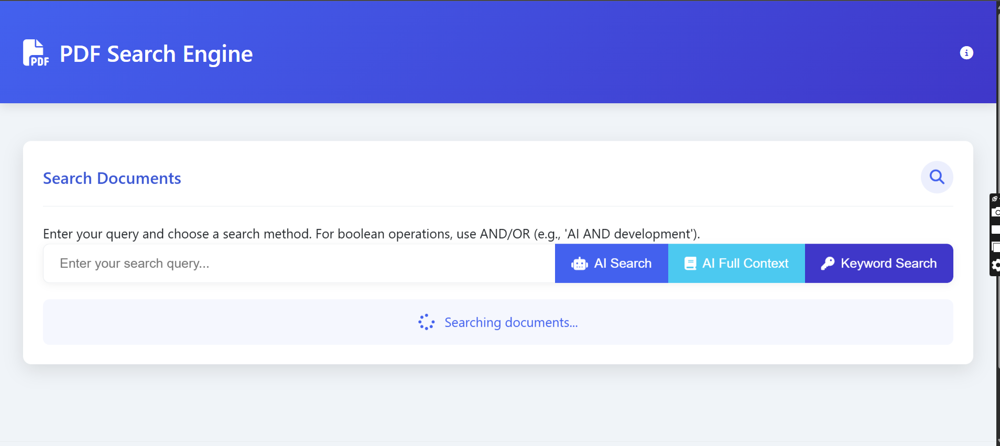
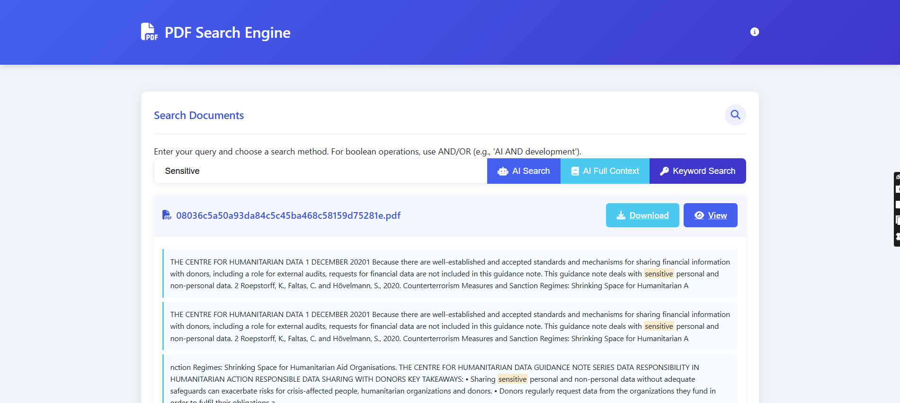
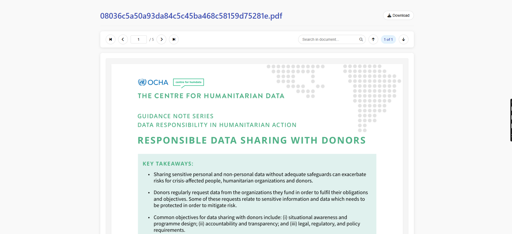

# 📄 Document Indexer & Local Search Engine

Automate classification, data extraction, and compliance checks for unstructured documents like **invoices**, **contracts**, **purchase orders**, and more.

> ⚠️ To request access or a demo, please **[contact us](mailto:venus.solutionshyd@gmail.com)**.

---

## 🚀 Features

- ✅ **Document Classification**  
  Automatically categorize uploaded documents by type (Invoice, PO, Contract, etc.)

- ✅ **Data Extraction**  
  Use OCR + NLP to pull out structured data fields (dates, totals, clauses, etc.)

- ✅ **Compliance Checks**  
  Flag missing fields, invalid terms, or compliance red flags.

- ✅ **Semantic Local Search**  
  Find documents via keyword or context-aware search powered by embeddings.

- ✅ **Fully Offline**  
  No data leaves your machine. Ideal for sensitive environments.

---

## 🧠 Tech Stack

- **OCR:** Tesseract, Azure Form Recognizer  
- **NLP:** spaCy, LayoutLM, LangChain  
- **Vector Search:** FAISS or ChromaDB  
- **UI (Optional):** Streamlit or Flask  
- **Storage:** Filesystem, SQLite, or JSON

---

## 🎯 Who Uses This?

- **Finance** — Invoice auditing, reconciliation  
- **Legal** — Contract clause extraction, red flag alerts  
- **Logistics** — Bill of lading, customs paperwork search  
- **Healthcare** — Claims processing, prescription classification

---

## 📸 Sample Screenshots

###  

---

### 

---

### 

---

## ⚙️ Workflow

1. Upload PDFs into `/documents`
2. Run the indexing pipeline (`run_indexer.py`)
3. Structured data is extracted and stored locally
4. Use CLI or UI to search/filter/query
